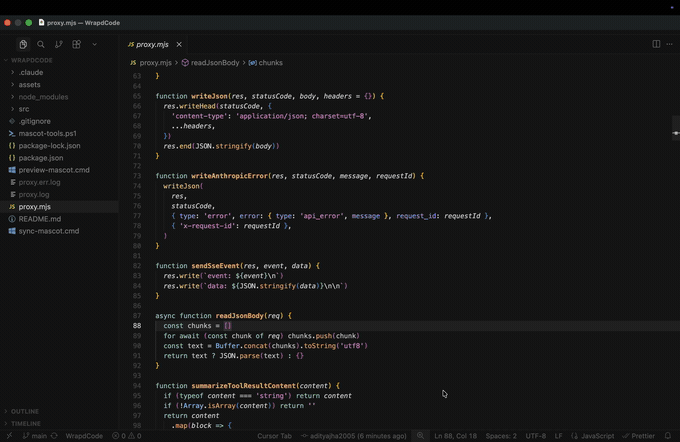

# WrapdCode

----
WrapdCode lets you run the Claude Code terminal app with **any AI model** via [OpenRouter](https://openrouter.ai) — Gemini, GPT, Claude, Llama, Mistral, and 300+ more.
It keeps the full Claude Code interface and tool workflow, routing all model requests through a local Anthropic-compatible proxy.

## Demo



Full-quality screen recording: [wrapdcode.mov](assets/wrapdcode.mov).

## How it works

1. Claude Code is installed on your machine.
2. `proxy.mjs` starts a local Anthropic-compatible proxy server.
3. Claude Code talks to that proxy as if it were Anthropic's backend.
4. The proxy forwards every request to OpenRouter, mapping the model name automatically.

## Requirements

- Node.js 18+
- Claude Code (`brew install --cask claude-code` or `npm install -g @anthropic-ai/claude-code`)
- An [OpenRouter](https://openrouter.ai) API key

## Run

```bash
# 1. Set your OpenRouter key
export OPENROUTER_API_KEY="sk-or-..."

# 2. Start the proxy (in the background)
node /path/to/proxy.mjs &

# 3. Point Claude Code at the proxy
export ANTHROPIC_BASE_URL="http://127.0.0.1:11435"
export ANTHROPIC_API_KEY="sk-proxy"

# 4. Launch Claude Code with any model
claude --model openai/gpt-4o-mini
claude --model google/gemini-2.5-pro
claude --model anthropic/claude-opus-4-5
claude --model meta-llama/llama-3.3-70b-instruct
```

Browse all available models at [openrouter.ai/models](https://openrouter.ai/models).

## Model name mapping

You can pass bare model names too — the proxy maps them automatically:

| You type | Sent to OpenRouter as |
|---|---|
| `google/gemini-2.5-pro` | `google/gemini-2.5-pro` (unchanged) |
| `gemini-2.5-flash` | `google/gemini-2.5-flash` |
| `claude-opus-4-5` | `anthropic/claude-opus-4-5` |
| `openai/gpt-4o` | `openai/gpt-4o` (unchanged) |

## Mascot

Edit the mascot in `src/components/LogoV2/Clawd.tsx` (`CLAWD_ART`).

## Repo files

- `proxy.mjs` — the Anthropic-compatible proxy server (no npm dependencies, Node.js built-ins only)
- `src/` — Claude Code UI source (mascot and branding)
- `mascot-tools.ps1` — sync mascot into an npm-installed Claude Code runtime (Windows)

## Troubleshooting

**Port already in use:**
```bash
lsof -ti tcp:11435 | xargs kill -9
```

**Watch proxy activity in real time:**
```bash
tail -f proxy.log
tail -f proxy.err.log
```

**Stop the proxy:**
```bash
lsof -ti tcp:11435 | xargs kill -9
```
